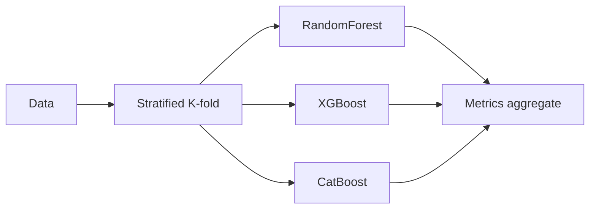

# Tabular Ensemble Arena

[](https://github.com/milos-plavsic/tabular-ensemble-arena/actions/workflows/ci.yml)
[](https://www.python.org/downloads/)

Rigorous comparison of **Random Forest**, **XGBoost**, and **CatBoost** on tabular classification using stratified cross-validation, ROC-AUC reporting, and a small reproducible benchmark harness suitable for extension (Optuna, calibration, stacking).

The ensemble workflow is also exposed as the `ensemble_benchmark` plugin in [agentic-ml-pipeline](https://github.com/milos-plavsic/agentic-ml-pipeline) (`POST /v1/studio/run`).

## Real-world data (education sector)

Benchmark rows come from **`data/student-mat.csv`** (UCI *Student Performance*, mathematics course): [UCI ML Repository — Student Performance](https://archive.ics.uci.edu/dataset/320/student+performance). The task is **pass vs not-pass** final grade (`G3 >= 10`), with **`G1` and `G2` removed** so the signal is closer to an early warning setup (questionnaire / school context only, then one-hot encoded).

## Why this exists

- Shows you understand **when each family wins** (bagging vs gradient boosting vs ordered boosting).
- Keeps evaluation **consistent**: same folds, same metric, **same real educational cohort**.
- Ships as a **library-style package** plus **HTTP API** for demos and integration tests.

## Quickstart

```bash
python3 -m venv .venv && source .venv/bin/activate
make install
make run          # leaderboard on UCI student math (pass/fail)
make test
make api          # http://127.0.0.1:8000/docs
```

Docker: `make docker-api` (Compose profile `api`).

## API

- OpenAPI: `http://127.0.0.1:8000/docs`
- `GET /health`
- `POST /v1/compare` with JSON body `{"cv_splits": 3}` (optional; data file is fixed)

## Architecture



## Models (defaults tuned for speed + sanity)

| Model | Notes |
|-------|--------|
| Random Forest | `class_weight='balanced_subsample'`, parallel trees |
| XGBoost | depth-limited boosting, column/row subsample, L2 |
| CatBoost | symmetric trees, ordered boosting path, no disk spill |

## API

- `GET /health`
- `POST /v1/compare` — JSON body `{"n_samples": 2000, "n_features": 20, "cv_splits": 3}` (bounds enforced server-side)

## Advanced extensions

- Nested CV + outer test holdout
- `RandomizedSearchCV` / Optuna per model family
- Probability calibration (`CalibratedClassifierCV`)
- SHAP / permutation importance per best model
- Stacking / `VotingClassifier` meta-learner

## License

MIT
